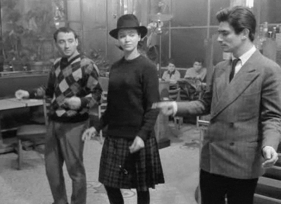

class: center

# .center[Prediction]


```{r knitr, include=TRUE, echo=FALSE}
library(knitr)

```

???

  Animals
  Plants

---
class: center
class: center

# .center[Prediction]

</br>
</br>
```{r, include=TRUE, echo=FALSE}

```

---

# Non-linguistic prediction

## Auditory prediction

--

Pitch

Rhythm

--

## Visuospatial anticipation

--

# Linguistic prediction

Lexical stress > verb tense, aspect, person, and number

---

# Pitch

## Coffee? vs. Coffee

--

.content-box-green[

Musical abilities influence positively the production and perception of linguistic sound structures in children <font size="-1">(Magne et al., 2006)</font>, adults <font size="-1">(Wong et al., 2007)</font> and L2 learners <font size="-1">(Slevc & Miyake, 2006)</font>.

]

.content-box-red[

Relative pitch and L1 tone knowledge not associated <font size="-1">(Ngo et al., 2016)</font>.

The creation of L2 tone-segment connections in musicians and non-musicians not promoted <font size="-1">(Chan & Leung, 2019)</font>. 

]

???

Pitch is the frequency associated to a sound wave; this frequency places the sound within a scale ranging from low to high in perception

---

# Rhythm

## Predictive in nature
## Multimodal

--

.content-box-green[
Rhythmic production scores reliable predictor of L2 lexical stress placement <font size="-1">(Cason et al., 2019)</font>. 

Rhythm perception is positively associated with length of L2 experience  <font size="-1">(Bhatara et al., 2015)</font>. 
]

.content-box-red[
Rhythm perception was not associated with reading abilities in both the L1 and L2 <font size="-1">(Swaminathan et al., 2018)</font>.
]

???

Rhythm is defined as a pattern of recurrent time intervals that usually occur periodically. This periodic nature allows to predict the start of an interval or the next recurring event based on what has already been perceived

---
    
# Visuospatial domain

</br>

- Reading and writing 

.center[dough vs. through]


- Signed languages

- Egocentric vs geocentric linguistic representation of space

???

Visuospatial abilities refer to the ability to process, work with and remember information in space perceived visually.

- Williams Syndrome, autism: slower, poorer and noisier processing of spatial concepts <font size="-1">(Bochynska et al., 2020; Landau & Hoffman, 2005)</font>

- Dyslexia: perform worse on visuospatial tasks (children, <font size="-1">Giovagnoli et al., 2016</font>, older teens and adults, <font size="-1">von Károlyi & Winner, 2004</font>)

---

exclude: true

# Linguistic anticipation
</br>
</br>
</br>
.pull-left[## Domain-specific]
</br>
.center[vs.]
</br>
.pull-right[## Domain-general]

---

# L1 anticipation

--

.pull-left[
Phonological cues:

- coarticulation <font size="-1">(Salverda et al., 2014)</font>
- intonation <font size="-1">(Nakamura et al., 2012; Weber et al., 2006)</font>
- lexical stress <font size="-1">(Correia et al., 2013; Sagarra & Casillas, 2018)</font>
- pauses between clauses <font size="-1">(Hawthorne & Gerken, 2014; Kjelgaard & Speer, 1999)</font>
- vowel duration <font size="-1">(Rehrig, 2017)</font>
- tone <font size="-1">(Roll & Horne, 2015; Roll et al., 2011)</font>    
]

.pull-right[
Morphosyntactic outcome:

- noun number <font size="-1">(Marull, 2017)</font>
- gender <font size="-1">(Dahan et al., 2000)</font>
- case (German, <font size="-1">Hopp, 2015</font>, Japanese, <font size="-1">Mitsugi & MacWhinney, 2016</font>)  
- tense <font size="-1">(Lozano et al., 2019; Sagarra & Casillas, 2018)</font>
]

---

# L1 anticipation

## Central Swedish

Low tone + singular: _fisken_ 'fish<sub>[SG]</sub>'     
High tone + plural: _fiskar_ 'fish<sub>[PL]</sub>' <font size="-1">     
(Roll et al., 2010)</font>

## Spanish
First syllable stressed + present: _canta_ 's/he sings'     
First syllable unstressed + past: _cantó_ 's/he sang' <font size="-1">     
(Sagarra & Casillas, 2018)</font>

---

# L2 speakers

- L1 transfer and L2 proficiency <font size="-1">(Dupoux et al., 2008; Dussias et al., 2013; Sagarra & Casillas, 2018)</font>

</br>

--
</br>

- Working memory

</br>

---

# Working memory

  - Domain-specific single-resource model <font size="-1">(Just & Carpenter, 1992)</font>
  - Domain-specific multiple-resource model <font size="-1">(Baddeley, 2007)</font>
  - Domain-free connectionist models <font size="-1">(e.g., Cowan, 2005)</font>

--

### L1 acquisition

--

### L2 proficiency

--

### Alphabet vs. logosyllables

--

### Music training

---

# Linguistic phenomena
</br>
## Lexical stress

 _TÉRmino_ 'term'     
 _terMIno_ 'I finish'     
 _termiNÓ_ 's/he finished'
 
## Tone

--

Phonological acquisition:
 - Speech Learning Model <font size="-1">(Flege, 1995)</font>
 - Perceptual Assimilation Model for L2 <font size="-1">(Best, 1995)</font>
 - Second Language Linguistic Perception <font size="-1">(Escudero, 2005)</font>

---

# Research Questions

--

## Study 1: Linguistic anticipation
	
**RQ1. Do Spanish monolinguals, and intermediate and advanced Mandarin and English learners of Spanish use lexical stress to anticipate verbal suffixes in Spanish?**      
**If so, are prediction abilities mediated by verbal WM?**

</br>
--
**H1.** Only monolingual and advanced L2 speakers will anticipate <font size="-1">(Lozano et al., 2019; Sagarra & Casillas, 2018)</font>, but L2 will not reach native-like performance <font size="-1">(Perdomo & Kaan, 2019)</font>.
WM will only affect performance in the L2 groups <font size="-1">(Huettig & Mani, 2016; Otten & van Berkum, 2009; Sagarra & Casillas, 2018)</font>.

---

# Research Questions

## Study 2: Auditory anticipation  
	
**RQ2. Is linguistic prediction of word morphology associated with auditory prediction in Spanish monolinguals, and intermediate and advanced Chinese and English learners of Spanish?**      
**If so, how do WM, L1 transfer and L2 proficiency mediate this relationship?**

--

**H2.** _Pitch_     
No association between pitch and speech prediction abilities in any group, so L2 proficiency will not be associated either. Mandarin speakers are expected to anticipate melodic information faster than any of the other populations.      
Pitch anticipation scores will be positively correlated with verbal WM scores in non-Mandarin speakers <font size="-1">(Roden et al., 2014)</font>. 

---

# Research Questions

## Study 2: Auditory anticipation   
	
**RQ2. Is linguistic prediction of word morphology associated with auditory prediction in Spanish monolinguals, and intermediate and advanced Chinese and English learners of Spanish?**      
**If so, how do WM, L1 transfer and L2 proficiency mediate this relationship?**

**H2.** _Rhythm_      
No relationship in monolinguals.
Better rhythm anticipation abilities are expected to be associatd with individual variability of speech anticipation in L2 participants <font size="-1">(Cason & Schön, 2012)</font>. For L2 speakers, this rhythmic influence on speech anticipation will be visible at all levels of proficiency and regardless of the L1.
WM is only expected to have an effect on rhythm prediction abilities for all speakers <font size="-1">(Colley et al., 2018)</font>.     

---

# Research Questions

## Study 3: Visuospatial anticipation   
	
**RQ3. Is linguistic prediction of word morphology associated with visuospatial prediction in Spanish monolinguals, and intermediate and advanced Chinese and English learners of Spanish?**      
**If so, how do WM, L1 transfer and L2 proficiency mediate this relationship?**

--

**H3.** Language prediction abilities in the L1 and the L2 are not expected to be associated with the visuospatial domain. 
WM will only be associated with speech L2 anticipation performance, and it might be associated with visuospatial WM due to cross-domain influence <font size="-1">(Colley et al., 2018)</font>. Visuospatial WM performance will in return be associated with visuospatial anticipation <font size="-1">(Pan et al., 2014; Woodman & Luck, 2004)</font>. 

---

# Methods

## Participants

- 30 monolinguals speakers of Spanish     
- 30 L2 Spanish intermediate with L1 English     
- 30 L2 Spanish advanced with L1 English     
- 30 L2 Spanish intermediate with L1 Mandarin     
- 30 L2 Spanish advanced with L1 Mandarin     

???
Right-handed
No bil education
Monolingual regions and families
Studies up to high school at least
At least two months living in Spanish-speaking countries
Late L2 learners
L2 use/week

---

# Methods

## Materials and procedure

- Spanish Proficiency Test
- Sociolinguistic Background Questionnaire
- Anticipation tasks:
  - Linguistic anticipation
  - Rhythm anticipation
  - Pitch anticipation
  - Visuospatial anticipation 
- Working memory tasks:     
  - Visuospatial memory
  - Verbal memory  
- Vocabulary test

---

# Methods

## Materials and procedure

- Spanish Proficiency Test     
- Sociolinguistic Background Questionnaire
.grey[
- Anticipation tasks:
  - Linguistic anticipation
  - Rhythm anticipation
  - Pitch anticipation
  - Visuospatial anticipation    
- Working memory tasks:     
  - Visuospatial memory
  - Verbal memory
  ]
- Vocabulary test

---

# Linguistic anticipation task

Visual-world paradigm

```{r, include=TRUE, echo=FALSE}
include_graphics("./00_intro/figs/vwp.png", dpi = 100) # the larger the number, the smaller the image
```

???
Close tracking of time

---

# Pitch anticipation task

~ Melody discrimination task

```{r, include=TRUE, echo=FALSE}
include_graphics("./00_intro/figs/tone_task.png", dpi = 130)
```

---

# Rhythm anticipation task

Imperative tone task

```{r, include=TRUE, echo=FALSE}
include_graphics("./00_intro/figs/rhythm_task.png", dpi = 108)
```

---

# Visuospatial anticipation task

~ Time/Movement anticipation task

```{r, include=TRUE, echo=FALSE}
include_graphics("./00_intro/figs/car_task.png", dpi = 108)
```

---

# Verbal working memory

Operation Span

```{r, include=TRUE, echo=FALSE}
include_graphics("./00_intro/figs/ospan.png", dpi = 108)
```

---

# Visuospatial working memory

Corsi-blocks task
.center[
```{r, include=TRUE, echo=FALSE}
include_graphics("./00_intro/figs/corsi.png", dpi = 140)
```
]
---

# Conclusion

</br>
**Goal:** to examine the role of language experience (L1 transfer, L2 proficiency) (Study 1), non-linguistic auditory prediction (Study 2), and visuospatial prediction (Study 3), on L1 and L2 linguistic prediction of word endings based on prosodic cues, and the mediation of verbal and visuospatial WM.

--
</br>
</br>
**Relevance:** Results would confirm whether different cognitive domains in the auditory modality can influence speech anticipation, and thus if anticipation relies at least partially on domain-general cognitive mechanisms that may be shared within and across modalities, and, therefore, whether better anticipatory abilities in other modalities do not affect linguistic prediction.

---

exclude: true
class: center
</br>
</br>
</br>
</br>
</br>
```{r, include=TRUE, echo=FALSE}

```

---
class: title-slide-section-red, center, middle

# Thank you!