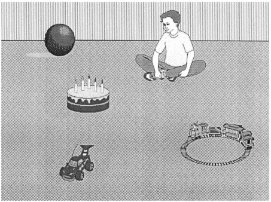

.center[
```{r knitr, include=TRUE, echo=FALSE, warning=FALSE}
library(knitr)

```

The boy will eat / the cake.
<font size="-1">(Altmann & Kamide, 1999)</font>
]
---

# Previous research
</br>

Between-speaker variability
<font size="-1">(e.g., Kaan, 2014; Wlotko et al., 2012)</font>
                
--

L2 speakers vs. L1 speakers: </br>
- less <font size="-1">(Perdomo & Kaan, 2020)</font>
- later <font size="-1">(Lozano-Argüelles et al., 2020)</font>
- never <font size="-1">(e.g., Hopp, 2015)</font>

---

# Previous research

- Working memory <font size="-1">(Otten & Van Berkum, 2009; Sagarra & Casillas, 2018)</font>
- L2 proficiency <font size="-1">(Schremm et al., 2016; Sagarra & Casillas, 2018)</font>
- Anticipatory experience <font size="-1">(Lozano-Argüelles et al., 2020)</font>

---

# Previous research

- Working memory <font size="-1">(Otten & Van Berkum, 2009; Sagarra & Casillas, 2018)</font>
- **L2 proficiency** <font size="-1">(Schremm et al., 2016; Sagarra & Casillas, 2018)</font>
- **Anticipatory experience** <font size="-1">(Lozano-Argüelles et al., 2020)</font>

---

# Our study

## Does language use affect L2 stress-tense prediction?
## How do L2 use effects differ from L2 proficiency effects in L2 stress-tense prediction?

--

</br>
L2 proficiency: 
- more proficiency = more prediction <font size="-1">(Schremm et al., 2016; Sagarra & Casillas, 2018)</font>

L2 use:
- more use = faster prediction <font size="-1">(Fernández Arroyo et al., under review)</font>

---

# Our study

Participants:
- 30 Spanish monolinguals
- 65 English speakers (L2 Spanish)

Materials:
- Sociolinguistic background questionnaire
- Proficiency test
- Visual world paradigm
  
---

# Visual world paradigm

.center[
```{r, include=TRUE, echo=FALSE}
include_graphics("./00_intro/figs/vwp.png", dpi = 100) # the larger the number, the smaller the image
```
]
???
Close tracking of time

---

# Our study

Participants:
- 30 Spanish monolinguals
- 65 English speakers (L2 Spanish) 

Materials:
- Sociolinguistic background questionnaire
- Proficiency test
- Visual world paradigm

Analysis:
- Growth Curve Analysis <font size="-1">(Mirman, 2014)</font>

```{r eval=FALSE}
eLog ~ 1 + (ot1 + ot2 + ot3) + 
    condition_sum + ot1:condition_sum + ot2:condition_sum + 
    DELE_z + ot1:DELE_z + 
    use_z + ot1:use_z + ot2:use_z +     
    use_z:condition_sum:DELE_z + ot1:use_z:condition_sum:DELE_z + 
    ot2:use_z:condition_sum:DELE_z + ot3:use_z:condition_sum:DELE_z +
    (1 + condition_sum + (ot1 + ot2 + ot3) | participant) +
    (1 + ot1 + ot2 | target)
```
  
---

# Results

Time course
.center[
```{r, include=TRUE, echo=FALSE, out.width="80%"}
include_graphics("./figs/use_prof/gca_verb/timecourse_l1_stressnames.png", dpi = 150)
```
]

---

# Results

Spanish speakers
.center[
```{r, include=TRUE, echo=FALSE, out.width="80%"}
include_graphics("./figs/stress/gca/stress_mon.png", dpi = 108)
```
]

---

# Results

L2 proficiency
.center[
```{r, include=TRUE, echo=FALSE, out.width="100%"}
include_graphics("./figs/use_prof/gca_verb/en_gca_prof_verb.png", dpi = 150)
```
]

---

# Results

L2 use
.center[
```{r, include=TRUE, echo=FALSE, out.width="100%"}
include_graphics("./figs/use_prof/gca_verb/en_gca_use_verb.png", dpi = 150)
```
]

---

# Results

Interaction
.center[
```{r, include=TRUE, echo=FALSE, out.width="100%"}
include_graphics("./figs/use_prof/gca_verb/en_gca_all_verb.png", dpi = 150)
```
]

---

# Summary and Discussion

Does language use affect L2 phonomorphological prediction? </br>
How do L2 use effects differ from L2 proficiency effects?

--

.pull-left[
.content-box-red[
*L2 proficiency*</br>
Faster prediction

]
]

--

.pull-right[
.content-box-green[
*L2 use*</br>
Later prediction

]
]

--

.center[
.content-box-yellow[
*Interaction*</br>
Paroxytones (CANta):
- over proficiency only when use is extensive: earlier prediction

Oxytones (canTÓ):
- over proficiency when use is reduced: earlier prediction
- over proficiency when use is extensive: more prediction
- over use when proficiency is high: later but faster prediction

]
]

---

# Summary and Discussion

- Proficiency contributes positively because it gives speakers familiarity with the standard and a restricted set of options.

- Increased L2 use provides more options, delaying and slowing down processing.

- Increased L2 use gives more certainty, helping to reach higher probability of prediction.

- L2 use and L2 proficiency are not exchangeable L2 experience measures.

- L2 use and anticipatory experience <font size="-1">(Lozano-Argüelles et al., 2020)</font> also have different effects.

- Stronger interactions in oxytone verbs because less typical.

???
- L2 proficiency may counteract (detrimental) L2 use effects.

--

</br>
</br>

.center[
      *Why do we see these L2 use effects rather than more L1-like performance?*
      ]

---

# Conclusion

</br>
</br>
.center[
We should carefully consider what language experience measures we should include and could be more informative, rather than just focusing on L2 proficiency. 
]

---
class: title-slide-section-red, center, middle

# Thank you!

laura.fdeza@rutgers.edu

