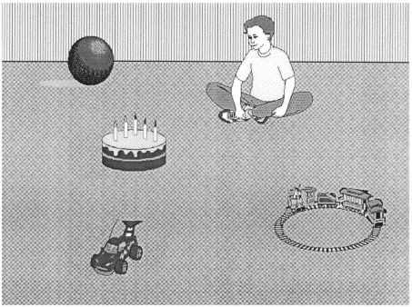

.center[
```{r knitr, include=TRUE, echo=FALSE, warning=FALSE}
library(knitr)

```

The boy will eat / the cake.
<font size="-1">(Altmann & Kamide, 1999)</font>
]
---

# Linguistic prediction and cognition

## Domain-specific accounts <font size="-1">(e.g., Ericsson & Charness, 1994; Gobet, 2015)</font>

## Domain-general accounts <font size="-1">(e.g., Anderson, 1990; Singley & Anderson, 1989)</font>

---

# Previous research
</br>

.pull-left[
.content-box-green[

Musical training
</br>
</br>
Syntax

]]

--

.pull-right[
.content-box-red[

General untrained auditory abilities
</br>
</br>
Morphophonology </br>
&nbsp;&nbsp;&nbsp;&nbsp;(lexical stress-verb tense suffix)

]]

---

# Our study

## Are pitch-based linguistic prediction in an L1 and L2 and melody prediction related?

## Does working memory mediate the relationship?

---

# Our study

- 30 Spanish monolinguals, 64 Mandarin Chinese speakers and 65 English speakers (L2 Spanish)

--

- Sociolinguistic background questionnaire
- Proficiency test
- Tasks:
  - Visual world paradigm
  - Melody anticipation task
  - Rhythmic synchronization task (Pagliarini, 2016)
  - Operation Span task (Unsworth et al., 2005)
  
---

# Visual world paradigm

.center[
```{r, include=TRUE, echo=FALSE}
include_graphics("./vwp.png", dpi = 100) # the larger the number, the smaller the image
```
]
???
Close tracking of time

---

# Melody anticipation task

.center[
```{r, include=TRUE, echo=FALSE}
include_graphics("./tone_task.png", dpi = 130)
```
]
???

Based on tone discrimination tasks


---

# Verbal working memory

.center[
```{r, include=TRUE, echo=FALSE}
include_graphics("./ospan.png", dpi = 108)
```
]
---

# Results

English speakers
.center[
```{r, include=TRUE, echo=FALSE, out.width="90%"}
include_graphics("./figs/music/gca/wm/gca_en.png", dpi = 150)
```
]


---

# Results

Mandarin Chinese speakers
.center[
```{r, include=TRUE, echo=FALSE, out.width="90%"}
include_graphics("./figs/music/gca/wm/gca_pitch_ma1.png", dpi = 108)
```
]


---

# Results

Spanish speakers
.center[
```{r, include=TRUE, echo=FALSE, out.width="90%"}
include_graphics("./figs/music/gca/wm/gca_pitch_mon.png", dpi = 108)
```
]

---

# Summary

## English
- More proficiency > faster prediction

---

# Summary

## English
- More proficiency > faster ling. prediction

## Mandarin Chinese
- More proficiency > more lling. prediction
- Faster pitch processing > more ling. prediction when +WM/-prof or -WM/+prof
- Slower pitch processing > more ling. prediction when +WM/+prof or -WM/-prof

---

# Summary

## English
- More proficiency > faster ling. prediction

## Mandarin Chinese
- More proficiency > more lling. prediction
- Faster pitch processing > more ling. prediction when +WM/-prof or -WM/+prof
- Slower pitch processing > more ling. prediction when +WM/+prof or -WM/-prof

## Spanish
- Later pitch > more ling. prediction 
- Later pitch and average or +WM  > more and later ling. prediction

---

# Discussion

- Spanish and Chinese speakers influenced by pitch abilities because of L1 experience and WM interacted:

  - domain-general approach (if familiar > associated w/ L2 prediction)
  - domain-general mechanism mediation
  - not straight-forward
  
- Consider more subject-specific characteristics   
  
---

# Conclusion

</br>
</br>
.center[
Linguistic prediction likely shares mechanisms and is underpinned by domain-general mechanisms.
]

---
class: title-slide-section-red, center, middle

# Thank you!


---


---

???
# Linguistic prediction

## Core component
<font size="-1">(Fitz & Chang, 2019; Kuperberg & Jaeger, 2016; Rabovsky et al., 2018)</font>

## Optimal component
<font size="-1">(Huettig & Mani, 2016; Pickering & Gambi, 2018)</font>

---

???
## Between-speaker variability
<font size="-1">(e.g., Kaan, 2014; Wlotko et al., 2012)</font>
                
--

L2 speakers vs. L1 speakers: </br>
- less <font size="-1">(Perdomo & Kaan, 2020)</font>
- later <font size="-1">Lozano-Argüelles et al., 2020</font>
- never <font size="-1">(Hopp, 2015)</font>

---
???

# Rhythm synchronization task

.center[
```{r, include=TRUE, echo=FALSE}
include_graphics("./rhythm_task.png", dpi = 108)
```
]

???

Imperative tone task

---

???

# Results

Mandarin Chinese speakers
.center[
```{r, include=TRUE, echo=FALSE, out.width="90%"}
include_graphics("./figs/music/gca/wm/gca_rhythm_ma.png", dpi = 108)
```
]

---

???
# Summary
Chinese: - Rhythm: better synchronization > faster prediction
&nbsp;&nbsp;&nbsp;&nbsp;&nbsp;&nbsp; l


???

# Results

Spanish speakers
.center[
```{r, include=TRUE, echo=FALSE, out.width="90%"}
include_graphics("./figs/music/gca/wm/gca_rhythm_mon.png", dpi = 108)
```
]

---

???
- Improvement over proficiency: prediction as an optimal component


